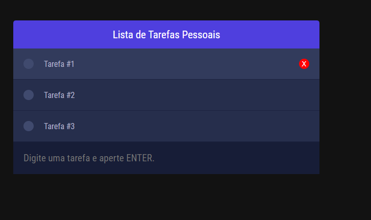

# Personal Todo-List
> Lista de Tarefas Simples, para acompanhar as tarefas do dia-a-dia.

## Futuramente, eu gostaria de incluir:

1. Descrições das tarefas, Prazos;
1. Grupos de tarefas;
1. Tags das tarefas;
1. Notificações, Atribuição de responsável;
1. Salvar os dados com uma conta (Google etc.)

# Screenshot

### Layout

- Título da Aplicação,
- Lista das Tarefas:
    - Botão para Concluir a **Tarefa**.
    - Nome da **Tarefa**.
    - Botão para Excluir a **Tarefa** (aparece ao passar o mouse na **tarefa**).
- Campo para Incluir uma nova **Tarefa**.